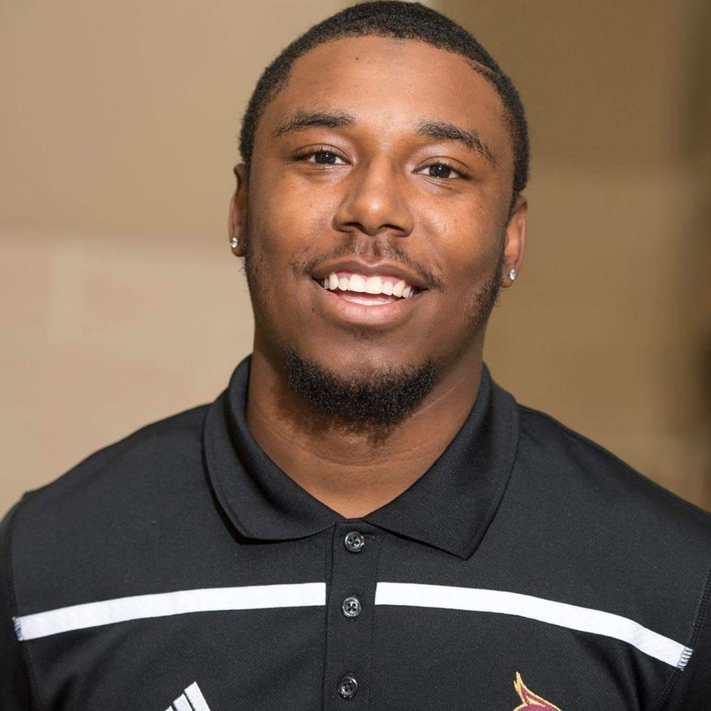

# 4Lifers:All you in one Spot

#### SavvyCoders August 2022 Capstone

## About Me

A multifaceted professional with a higher education background and experience ranging from recruiting, supervision, and project management. I have extensive experience in budget management, emotional intelligence, training/development, and program coordination.

I’m currently transitioning into the #tech world by way of Full Stack Development learning how to code in HTML, .CSS, and JavaScript. I've always had my hands in different pots working in Higher Education and Facilities Management but the drive and passion for technology never left.

As a little boy I can remember getting my first video game (Madden of course) and seeing how the graphics of the video games where evolving I knew I had to be a part of this experience. In undergraduate and graduate school I always found myself around a computer lab or talking to IT because I was messing with computer and trying different things.

It was not until recently when I went to a networking event and learned that it is not too late to change my career and follow my passion.

### Capstone

During my time at Savvy Coders I have had the opportunity to build a prototype single page web application as a final project for the bootcamp and certification. My web application is geared towards a one stop shop for fashion for young men and shoe cleaning services.

This web application is a combination of other ventures and hobbies I do in my spare time. As the user they will be able to make tshirt purchases, request a shoe cleaning service (future venture), and listen to my very one Podcast that was created by me as well as co-hosted.

_Here are just a few technologies used in creating and hosting this application._

1. Javascript
2. Html
3. Css
4. Netlify
5. Heroku
6. MongoDB
7. Formsfree.com

These applications helped shaped my coding career and really look forward to continue on this path to become a coder and UX/UI designer one day.

_This is only the beginning as I plan to keep improving learning different languages and technologies in this world of computers._
